# Brew &amp; Justice


[](https://github.com/billybox1926-jpg/Brew-Justice/issues/19)
[](https://github.com/billybox1926-jpg/Brew-Justice/issues?q=is%3Aissue+is%3Aopen+label%3A%22good+first+issue%22)

<p align="center">
  
</p>

A cozy neo-noir game about coffee, community, and **sensory justice** — built
in Godot 4.4 (GDScript).

## Why this exists

Different minds perceive the world deeply and intensely. Most games bolt
accessibility on as a settings menu. **Brew &amp; Justice inverts that:** the way
a player regulates their own sensory load *is* the game. There is no "normal"
mode and a "helper" mode — accessibility **is** the genre.

The premise is a small borough cafe where the detective's sharpest tool is
rhythm. Holding a steady beat calms them; that calm leaks into the room and the
space opens up around them. Disruption is noise, not a separate health bar: a
chaos spike jitters the beat and throttles how much peace reaches the world.
The shield and the weapon share the same currency — **rhythm.** Solving the
mystery means learning to regulate, not overpowering anything.

## Build this with us

This is an open invitation. The slice is small and the architecture is
signal-driven and approachable — a good first open-source contribution if
you care about games that respect how minds actually work.

- **Good first issues** — small, self-contained starts:
  [filter](https://github.com/billybox1926-jpg/Brew-Justice/issues?q=is%3Aissue+is%3Aopen+label%3A%22good+first+issue%22)
  (#3 neon overlay, #5 WIRING doc, #6 chaos UI, #7 BandPass tune-in).
- **Help wanted** — broader systems work:
  [filter](https://github.com/billybox1926-jpg/Brew-Justice/issues?q=is%3Aissue+is%3Aopen+label%3A%22help+wanted%22)
  (#8 presence listeners, #14 trail legibility, #17 cafe ambience).
- **All issues** are organized into four
  [milestones](https://github.com/billybox1926-jpg/Brew-Justice/milestones) with
  parent/child structure. Start from an epic and read down.
- Read [CONTRIBUTING.md](CONTRIBUTING.md) first (the one rule: accessibility
  *is* the design), then the [wiki](https://github.com/billybox1926-jpg/Brew-Justice/wiki)
  for how it's built.

## The loop at a glance

```
                focus (F)
   Baseline ───────────────▶ Hyperfocus
      ▲                        │
      │ reset (R) / load drops│ load rises (click / time)
      │                        ▼
      │                     Overload
      └──── stim release (Space) ┘

   Baseline   0-40    periphery open, clue dim
   Hyperfocus 41-75   perception boosted
   Overload   76-100  periphery collapses, clue bright
```

Two signals ride on top of the state:

- **`presence`** rises with each steady `rhythm_pulse` and eases the vignette
  back — the room co-regulates with the player.
- **`chaos`** (from a disruptor) injects jitter into the beat and throttles the
  calm leak, so the space recoils. It decays on its own; keep stimming to win
  your peace back.

## Signal flow

```
  StimTool ──rhythm_pulse──▶ FocusModeMain ──load──▶ SensoryMeter
     │                          │  ▲
     └──stim_released──────────┘  │ mode
                                  │
  Disruptor ──chaos_pulse────────┘
                                  │
        FocusModeMain emits to:
          • SFX bus        (LowPass + HighPass + BandPass)  [audio targets]
          • Vignette + clue markers   (presence, peripheries)  ┄ chaos throttles
          • Ambient light + NPC       (presence)              ┄ chaos throttles
```

Everything is wired through signals, not tree-scans: `FocusModeMain` owns a
reference to `stim` and reads `chaos`, and the meter/labels react to emitted
changes. The Disruptor is inert until you connect its `chaos_pulse` to
`FocusModeMain._on_chaos`.

## Playable demo (vertical slice)

A runnable Godot 4.4 vertical slice lives in `vertical-slice/godot/`. It is a
self-contained "focus-mode" scene that demonstrates the core loop described
above.

### Run it

1. Open `vertical-slice/godot/project.godot` in **Godot 4.4**.
2. Open `scenes/focus_mode.tscn`.
3. Press **F5** to run the scene.

### Controls

| Key / Input      | Action                                                        |
| ---------------- | ------------------------------------------------------------- |
| `F`              | Toggle focus mode (dims periphery, boosts perception)        |
| `Hold Space`     | Rhythmic stim: charges, and emits a calm pulse each beat      |
| `Release Space`  | Release the stim — drops sensory load by charge strength      |
| `Left Click`     | Raise sensory load (push toward Overload)                     |
| `R`              | Reset the Sensory Meter to baseline                           |
| `C`              | Inject a chaos spike (opt-in disruption — see below)          |

### How the loop reads

- Hold **Space** and keep a steady beat → `rhythm_pulse` fires (~1.8 beats/sec,
  ramping in over the first ~3 beats like entrainment). Each pulse raises
  `presence` and the vignette softens.
- Press **C** → a `chaos` spike jitters the beat clock and throttles the calm
  leak, so the room recoils. `chaos` decays on its own; keep stimming to win
  your peace back.

### Opt-in disruptor

`scripts/disruptor.gd` is a `Disruptor` node that emits `chaos_pulse(strength)`
on a randomized interval. It does **nothing** until you add it to the scene and
connect its `chaos_pulse` signal to `FocusModeMain._on_chaos`. By default the
room stays a sanctuary.

## Live prototype (no build step)

Prefer to feel the loop without opening Godot? The early prototype is a single
self-contained file:

➡️ **[Open `prototype/focus-mode.html` in your browser](prototype/focus-mode.html)** — no
server, no build step.

It explores the same focus-mode loop with the Web Audio API:

- **F** — toggle focus mode (dims the periphery, brightens the tire-tread clue)
- **Hold Space** — rhythmic stim; gently lowers sensory load while held
- **Click canvas** — raise sensory load toward Overload
- Web Audio ambient (low rumble + high hiss) that reshapes per state, plus an
  Overload drone when the meter peaks

<details>
<summary>View the prototype source</summary>

```html
<!DOCTYPE html>
<html lang="en">
<head>
    <meta charset="UTF-8">
    <meta name="viewport" content="width=device-width, initial-scale=1.0">
    <title>Brew & Justice — Focus Mode Prototype</title>
    <style>
        * { box-sizing: border-box; }
        html, body { margin: 0; padding: 0; height: 100%; background: #0b0b0f; color: #dce3ec; font-family: ui-monospace, "Segoe UI Mono", "Courier New", monospace; overflow: hidden; }
        #wrap { position: relative; width: 100vw; height: 100vh; }
        canvas { display: block; width: 100%; height: 100%; }
        #ui { position: absolute; left: 16px; top: 16px; width: 280px; }
        .card { background: #0e1117bf; border: 1px solid #1f2937; padding: 14px; border-radius: 10px; backdrop-filter: blur(4px); }
        .meter { height: 10px; background: #0b0f18; border-radius: 999px; overflow: hidden; margin-top: 10px; position: relative; }
        .fill { height: 100%; width: 0%; background: linear-gradient(90deg, #22d3ee7a, #a78bfa7a, #fb71857a); border-radius: 999px; transition: width .25s linear; }
        .state { font-size: 12px; margin-top: 8px; letter-spacing: 0.08em; color: #7aa7ca; }
        .meta { font-size: 11px; color: #5b6578; margin-top: 6px; }
        .legend { margin-top: 8px; font-size: 11px; color: #8c95aa; }
        .legend b { color: #dcdfe6; }
        #pulse { position: absolute; left: 6px; right: 6px; top: 50%; height: 14px; transform: translateY(-50%); border-radius: 999px; opacity: 0; background: radial-gradient(circle, rgba(34,211,238,0.7), rgba(167,139,250,0.0)); pointer-events: none; transition: opacity .15s linear; }
        .pulsing #pulse { opacity: 0.9; }
    </style>
</head>
<body>
<div id="wrap">
    <canvas id="scene"></canvas>
    <div id="ui">
        <div class="card" id="card">
            <div class="state">SENSORY METER</div>
            <div class="meter">
                <div id="sensoryFill" class="fill"></div>
                <div id="pulse"></div>
            </div>
            <div class="meta" id="state">Baseline — borough ambient</div>
            <div class="meta" id="audioState">Audio: none</div>
            <div class="legend"><b>F</b> toggle focus</div>
            <div class="legend"><b>Click canvas</b> raise load</div>
            <div class="legend"><b>Hold Space</b> rhythmic stim</div>
        </div>
    </div>
</div>

<script>
const canvas = document.createElement('canvas');
const host = document.getElementById('scene');
host.appendChild(canvas);
const ctx = canvas.getContext('2d');
const fill = document.getElementById('sensoryFill');
const stateEl = document.getElementById('state');
const audioStateEl = document.getElementById('audioState');
const card = document.getElementById('card');

let W, H;
function resize() {
    const wrap = document.getElementById('wrap');
    W = canvas.width = wrap.clientWidth;
    H = canvas.height = wrap.clientHeight;
    buildTrack();
}
window.addEventListener('resize', resize);

let sensory = 18; // 0-100
let focus = false;
let stimHolding = false;
let stimCharge = 0; // 0..1 charge while held
let stimCooldown = 0;
let audioReady = false;
let audioCtx, masterGain, lowBand, highBand, overloadOsc, overloadGain;
let ambientNodes = [];

function createAudio() {
    if (audioReady) return;
    try {
        audioCtx = new (window.AudioContext || window.webkitAudioContext)();
        masterGain = audioCtx.createGain();
        masterGain.gain.value = 0.35;
        masterGain.connect(audioCtx.destination);

        // Low-frequency thrum: rain / traffic rumble
        const bufSize = audioCtx.sampleRate * 2;
        const buf = audioCtx.createBuffer(1, bufSize, audioCtx.sampleRate);
        const data = buf.getChannelData(0);
        for (let i = 0; i < bufSize; i++) data[i] = (Math.random() * 2 - 1) * 0.5;
        const lowNoise = audioCtx.createBufferSource();
        lowNoise.buffer = buf;
        lowNoise.loop = true;

        lowBand = audioCtx.createBiquadFilter();
        lowBand.type = 'lowpass';
        lowBand.frequency.value = 180;
        lowBand.Q.value = 0.7;
        lowNoise.connect(lowBand).connect(masterGain);
        lowNoise.start();

        // Higher hiss: distant city / rain on metal
        const highBuf = audioCtx.createBuffer(1, bufSize, audioCtx.sampleRate);
        const hd = highBuf.getChannelData(0);
        for (let i = 0; i < bufSize; i++) hd[i] = (Math.random() * 2 - 1) * 0.25;
        const highNoise = audioCtx.createBufferSource();
        highNoise.buffer = highBuf;
        highNoise.loop = true;

        highBand = audioCtx.createBiquadFilter();
        highBand.type = 'highpass';
        highBand.frequency.value = 1200;
        highBand.Q.value = 0.5;
        highNoise.connect(highBand).connect(masterGain);
        highNoise.start();

        ambientNodes = [lowNoise, highNoise];
        applyAudioForState();
        audioReady = true;
        card.addEventListener('pointerdown', unlockAudio, { once: true });
    } catch (e) {
        audioStateEl.textContent = 'Audio unavailable';
    }
}

function unlockAudio() {
    if (audioCtx && audioCtx.state === 'suspended') audioCtx.resume();
}

function applyAudioForState() {
    if (!audioReady) return;
    if (audioCtx.state === 'suspended') audioCtx.resume();
    const s = sensory;
    if (s < 40) {
        lowBand.frequency.setTargetAtTime(180, audioCtx.currentTime, 0.15);
        highBand.frequency.setTargetAtTime(1200, audioCtx.currentTime, 0.15);
        highBand.gain?.setTargetAtTime(1, audioCtx.currentTime, 0.1);
        overloadGain && overloadOsc && (overloadGain.gain.setTargetAtTime(0, audioCtx.currentTime, 0.1));
    } else if (s < 75) {
        // Focus: high-cut — high band drops; emphasize low thrum + breath
        lowBand.frequency.setTargetAtTime(220, audioCtx.currentTime, 0.15);
        highBand.frequency.setTargetAtTime(600, audioCtx.currentTime, 0.25);
        overloadGain && overloadOsc && (overloadGain.gain.setTargetAtTime(0, audioCtx.currentTime, 0.1));
    } else {
        // Overload: piercing highs + unstable high band
        lowBand.frequency.setTargetAtTime(260, audioCtx.currentTime, 0.2);
        highBand.frequency.setTargetAtTime(2600, audioCtx.currentTime, 0.2);
        spawnOverloadDrone();
        overloadGain && overloadOsc && (overloadGain.gain.setTargetAtTime(0.25, audioCtx.currentTime, 0.1));
    }
}

function spawnOverloadDrone() {
    if (overloadOsc) return;
    try {
        overloadOsc = audioCtx.createOscillator();
        overloadOsc.type = 'sawtooth';
        overloadOsc.frequency.value = 220 + Math.random() * 120;
        const f = audioCtx.createBiquadFilter();
        f.type = 'bandpass';
        f.frequency.value = 3200;
        f.Q.value = 6;
        overloadGain = audioCtx.createGain();
        overloadGain.gain.value = 0.2;
        overloadOsc.connect(f).connect(overloadGain).connect(masterGain);
        overloadOsc.start();
    } catch (e) {
        // noop
    }
}

document.addEventListener('keydown', (e) => {
    if (e.key === 'f' || e.key === 'F') focus = !focus;
    if (e.key === ' ' && stimCooldown <= 0) { stimHolding = true; stimCharge = 0; e.preventDefault(); }
});
document.addEventListener('keyup', (e) => {
    if (e.key === ' ') { stimHolding = false; e.preventDefault(); }
});
host.addEventListener('mousedown', () => { sensory = Math.min(100, sensory + 9); createAudio(); });

let track = [];
function buildTrack() {
    track = [];
    const steps = 260;
    for (let i = 0; i < steps; i++) {
        const t = i / steps;
        const x = W * 0.22 + t * W * 0.56;
        const y = H * 0.78 - Math.sin(t * Math.PI * 2.3) * H * 0.18 - t * H * 0.12;
        track.push({x, y});
    }
}

class Drop {
    constructor() { this.reset(true); }
    reset(initial) {
        this.x = Math.random() * W;
        this.y = initial ? Math.random() * H : -20;
        this.vy = 110 + Math.random() * 240;
        this.len = 12 + Math.random() * 18;
        this.alpha = 0.06 + Math.random() * 0.12;
    }
    step(dt) { this.y += this.vy * dt; if (this.y > H + this.len) this.reset(false); }
    draw() {
        ctx.strokeStyle = `rgba(90, 195, 230, ${this.alpha})`;
        ctx.lineWidth = 1.2;
        ctx.beginPath();
        ctx.moveTo(this.x, this.y);
        ctx.lineTo(this.x, this.y + this.len);
        ctx.stroke();
    }
}
const drops = Array.from({length: 160}, () => new Drop());

function vignette(strength) {
    const r = Math.min(W, H) * (0.55 + strength * 0.22);
    const g = ctx.createRadialGradient(W/2, H/2, r * 0.2, W/2, H/2, r);
    g.addColorStop(0, 'rgba(0,0,0,0)');
    g.addColorStop(1, `rgba(0,0,0,${0.15 + strength * 0.55})`);
    ctx.fillStyle = g;
    ctx.fillRect(0, 0, W, H);
}

function drawSmudge(pts) {
    // "Before" state: faint, blurry, ambiguous mark
    ctx.strokeStyle = 'rgba(180, 170, 160, 0.18)';
    ctx.lineWidth = 18;
    ctx.lineCap = 'round';
    ctx.beginPath();
    ctx.moveTo(pts[0].x, pts[0].y);
    for (let i = 1; i < pts.length - 1; i += 2) {
        const mx = (pts[i].x + pts[i+1].x) * 0.5;
        const my = (pts[i].y + pts[i+1].y) * 0.5;
        ctx.quadraticCurveTo(pts[i].x, pts[i].y, mx, my);
    }
    ctx.stroke();

    ctx.strokeStyle = 'rgba(220, 220, 210, 0.22)';
    ctx.lineWidth = 8;
    ctx.stroke();
}

function drawClue(time) {
    const intensity = focus ? 0.92 : 0.18;
    const pulse = 1 + Math.sin(time * 3.8) * 0.18;

    // neon glow
    ctx.shadowBlur = focus ? 26 : 6;
    ctx.shadowColor = 'rgba(0,255,245,0.8)';
    ctx.strokeStyle = `rgba(0, 240, 255, ${intensity})`;
    ctx.lineWidth = 3;
    ctx.lineJoin = 'round';
    ctx.lineCap = 'round';
    ctx.beginPath();
    ctx.moveTo(track[0].x, track[0].y);
    for (let i = 1; i < track.length; i++) ctx.lineTo(track[i].x, track[i].y);
    ctx.stroke();
    ctx.shadowBlur = 0;

    if (focus) {
        // energized head particle
        const t = (Math.sin(time * 4.9) * 0.5 + 0.5);
        const idx = Math.floor(t * (track.length - 1));
        const p = track[idx];
        ctx.fillStyle = '#ffffff';
        ctx.beginPath();
        ctx.arc(p.x, p.y, 3.6 * pulse, 0, Math.PI * 2);
        ctx.fill();

        // subtle text hint
        ctx.fillStyle = 'rgba(255,255,255,0.85)';
        ctx.font = '11px ui-monospace, monospace';
        ctx.fillText('tire tread — investigate', p.x + 10, p.y - 6);
    }
}

function determineMode() {
    if (sensory < 40) return 'Baseline';
    if (sensory < 75) return 'Hyperfocus';
    return 'Overload';
}

let last = performance.now();
let timeAgo = 0;

function frame(now) {
    const dt = Math.min(0.05, (now - last) / 1000);
    last = now;
    timeAgo += dt;

    // Stim tool: hold space -> gentle drop + pulse
    if (stimHolding && stimCooldown <= 0) {
        stimCharge = Math.min(1, stimCharge + dt * 0.6);
        sensory = Math.max(0, sensory - 18 * dt);
    } else if (!stimHolding && stimCharge > 0) {
        const drop = stimCharge * 14;
        sensory = Math.max(0, sensory - drop);
        stimCharge = 0;
        stimCooldown = 30;
    }
    if (stimCooldown > 0) stimCooldown--;

    // Focus raises sensory slowly
    if (focus) sensory = Math.min(100, sensory + 6 * dt);

    // mode
    const mode = determineMode();
    const peripheral = sensory < 75 ? (sensory < 40 ? 1 : 0.4) : 0.18;
    const clueVisibility = sensory < 40 ? 0.2 : (sensory < 75 ? 0.7 : 0.95);

    // Draw scene
    ctx.fillStyle = '#0b0f16';
    ctx.fillRect(0, 0, W, H);
    ctx.fillStyle = '#0e1520';
    ctx.fillRect(0, Math.floor(H * 0.68), W, H - Math.floor(H * 0.68));

    ctx.fillStyle = 'rgba(10, 35, 55, 0.85)';
    ctx.beginPath(); ctx.ellipse(W * 0.55, H * 0.82, W * 0.18, H * 0.04, 0.1, 0, Math.PI * 2); ctx.fill();
    ctx.beginPath(); ctx.ellipse(W * 0.3, H * 0.9, W * 0.08, H * 0.015, 0.25, 0, Math.PI * 2); ctx.fill();

    ctx.globalAlpha = peripheral;
    drops.forEach(d => { d.step(dt); d.draw(); });

    ctx.globalAlpha = clueVisibility;
    drawSmudge(track);
    drawClue(timeAgo);
    ctx.globalAlpha = 1;

    const strength = sensory / 100 * (focus ? 0.6 : 0.3);
    vignette(strength);

    // UI
    fill.style.width = (sensory / 100 * 100).toFixed(1) + '%';
    if (stimHolding && stimCharge > 0.1) {
        card.classList.add('pulsing');
        fill.style.background = `linear-gradient(90deg, #22d3ee7a, #4ade80aa)`;
    } else {
        card.classList.remove('pulsing');
        fill.style.background = 'linear-gradient(90deg, #22d3ee7a, #a78bfa7a, #fb71857a)';
    }
    const focusText = focus ? 'Focus' : 'Baseline';
    stateEl.textContent = `${focusText} · ${mode} — ${sensory.toFixed(0)}%`;
    audioStateEl.textContent = `Audio: ${audioReady ? 'on' : 'off'}`;

    // Periodic audio state updates
    if (audioReady && Math.floor(timeAgo * 4) !== Math.floor((timeAgo - dt) * 4)) applyAudioForState();

    requestAnimationFrame(frame);
}

resize();
requestAnimationFrame(frame);
</script>
</body>
</html>
```

</details>

## Roadmap

Tracked across four milestones. Full issue list:
[#19 README upgrade](https://github.com/billybox1926-jpg/Brew-Justice/issues/19) · milestones below.

| Milestone | Theme | Highlights |
| --- | --- | --- |
| [#2 Vertical Slice Polish](https://github.com/billybox1926-jpg/Brew-Justice/milestone/2) | Ship the slice | Disruptor wiring (#4), neon-flicker overlay (#3), scent/locator trail (#14), vignette calm signal (#18), WIRING doc (#5), on-screen chaos UI (#6) |
| [#3 Sensory Systems](https://github.com/billybox1926-jpg/Brew-Justice/milestone/3) | Sound + world react | BandPass "tune-in" (#7), presence-driven light + NPC (#8), smudge→neon clue (#9), real cafe ambience (#17), legible trail (#14) |
| [#4 Narrative &amp; World](https://github.com/billybox1926-jpg/Brew-Justice/milestone/4) | The mystery | Sensory-crime loop (#10), antagonist-as-chaos lore (#11), clue-graph model (#15) |
| [#5 Accessibility Audit](https://github.com/billybox1926-jpg/Brew-Justice/milestone/5) | Sensory justice, verified | Colorblind-safe palette (#12), input remap + captions (#13), persist prefs (#16) |

## Project layout

```
vertical-slice/godot/
  scenes/focus_mode.tscn      # the runnable demo scene
  scripts/
    focus_mode_main.gd        # scene root: state, audio buses, draw, signals
    sensory_meter.gd          # load state + Baseline/Hyperfocus/Overload tiers
    focus_toggle.gd           # focus mode on/off signal
    stim_tool.gd              # hold-to-charge stim + rhythm_pulse + chaos
    disruptor.gd              # opt-in chaos source (inert until connected)
prototype/
  focus-mode.html             # early non-Godot prototype (Web Audio)
assets/
  readme-focus-mock.svg       # animated loop preview used above
WIRING.md                     # 90-second Godot wiring checklist
```

## Documentation

- **Contributing** — see [CONTRIBUTING.md](CONTRIBUTING.md) (workflow, branch
  hygiene, how issues/milestones/labels are organized, and the sensory-safety
  rule). A short [CONTRIBUTORS.md](CONTRIBUTORS.md) points here.
- **Architecture** — see [ARCHITECTURE.md](ARCHITECTURE.md) for the full
  signal-driven design behind the diagrams above.
- **Code of Conduct** — [CODE_OF_CONDUCT.md](CODE_OF_CONDUCT.md). Sensory-safe
  space; we hold a higher bar because the game is *about* sensory justice.
- **Security** — [SECURITY.md](SECURITY.md) for private vulnerability reporting.

## License

MIT — see `LICENSE`.
