# Brew &amp; Justice


[](https://github.com/billybox1926-jpg/Brew-Justice/issues?q=is%3Aissue+is%3Aopen+label%3A%22good+first+issue%22)

<p align="center">
  
</p>

A cozy neo-noir game about coffee, community, and **sensory justice** — built
in Godot 4.4 (GDScript).

## Why this exists

Different minds perceive the world deeply and intensely. Most games bolt
accessibility on as a settings menu. **Brew &amp; Justice inverts that:** the way
a player regulates their own sensory load *is* the game. There is no "normal"
mode and a "helper" mode — accessibility **is** the genre.

The premise is a small borough cafe where the detective's sharpest tool is
rhythm. Holding a steady beat calms them; that calm leaks into the room and the
space opens up around them. Disruption is noise, not a separate health bar: a
chaos spike jitters the beat and throttles how much peace reaches the world.
The shield and the weapon share the same currency — **rhythm.** Solving the
mystery means learning to regulate, not overpowering anything.

## Build this with us

This is an open invitation. The slice is small and the architecture is
signal-driven and approachable — a good first open-source contribution if
you care about games that respect how minds actually work.

See [roadmap.md](roadmap.md) for milestones, issue highlights, and project layout.

Read [CONTRIBUTING.md](CONTRIBUTING.md) first (the one rule: accessibility
*is* the design), then the [wiki](https://github.com/billybox1926-jpg/Brew-Justice/wiki)
for how it's built.

## The loop at a glance

```
                focus (F)
   Baseline ───────────────▶ Hyperfocus
      ▲                        │
      │ reset (R) / load drops│ load rises (click / time)
      │                        ▼
      │                     Overload
      └──── stim release (Space) ┘

   Baseline   0-40    periphery open, clue dim
   Hyperfocus 41-75   perception boosted
   Overload   76-100  periphery collapses, clue bright
```

Two signals ride on top of the state:

- **`presence`** rises with each steady `rhythm_pulse` and eases the vignette
  back — the room co-regulates with the player.
- **`chaos`** (from a disruptor) injects jitter into the beat and throttles the
  calm leak, so the space recoils. It decays on its own; keep stimming to win
  your peace back.

## Signal flow

```
  StimTool ──rhythm_pulse──▶ FocusModeMain ──load──▶ SensoryMeter
     │                          │  ▲
     └──stim_released──────────┘  │ mode
                                  │
  Disruptor ──chaos_pulse────────┘
                                  │
        FocusModeMain emits to:
          • SFX bus        (LowPass + HighPass + BandPass)  [audio targets]
          • Vignette + clue markers   (presence, peripheries)  ┄ chaos throttles
          • Ambient light + NPC       (presence)              ┄ chaos throttles
```



Everything is wired through signals, not tree-scans: `FocusModeMain` owns a
reference to `stim` and reads `chaos`, and the meter/labels react to emitted
changes. The Disruptor is inert until you connect its `chaos_pulse` to
`FocusModeMain._on_chaos`.

## Playable demo (vertical slice)

A runnable Godot 4.4 vertical slice lives in `vertical-slice/godot/`. It is a
self-contained "focus-mode" scene that demonstrates the core loop described
above.

### Run it

1. Open `vertical-slice/godot/project.godot` in **Godot 4.4**.
2. Open `scenes/focus_mode.tscn`.
3. Press **F5** to run the scene.

### Controls

| Key / Input      | Action                                                        |
| ---------------- | ------------------------------------------------------------- |
| `F`              | Toggle focus mode (dims periphery, boosts perception)        |
| `Hold Space`     | Rhythmic stim: charges, and emits a calm pulse each beat      |
| `Release Space`  | Release the stim — drops sensory load by charge strength      |
| `Left Click`     | Raise sensory load (push toward Overload)                     |
| `R`              | Reset the Sensory Meter to baseline                           |
| `C`              | Inject a chaos spike (opt-in disruption — see below)          |

### How the loop reads

- Hold **Space** and keep a steady beat → `rhythm_pulse` fires (~1.8 beats/sec,
  ramping in over the first ~3 beats like entrainment). Each pulse raises
  `presence` and the vignette softens.
- Press **C** → a `chaos` spike jitters the beat clock and throttles the calm
  leak, so the room recoils. `chaos` decays on its own; keep stimming to win
  your peace back.

### Opt-in disruptor

`scripts/disruptor.gd` is a `Disruptor` node that emits `chaos_pulse(strength)`
on a randomized interval. It is wired into `scenes/focus_mode.tscn` with tuned
intervals so chaos pulses feel like external disruption instead of constant
noise. `FocusModeMain` surfaces it on-screen as **static %** and routes it to
the disruption overlay, peripheries, and audio bus.

## Live prototype (no build step)

Prefer to feel the loop without opening Godot? The early prototype is a single
self-contained file:

➡️ **[Open `prototype/focus-mode.html` in your browser](prototype/focus-mode.html)** — no
server, no build step.

It explores the same focus-mode loop with the Web Audio API:

- **F** — toggle focus mode (dims the periphery, brightens the tire-tread clue)
- **Hold Space** — rhythmic stim; gently lowers sensory load while held
- **Click canvas** — raise sensory load toward Overload
- Web Audio ambient (low rumble + high hiss) that reshapes per state, plus an
  Overload drone when the meter peaks
